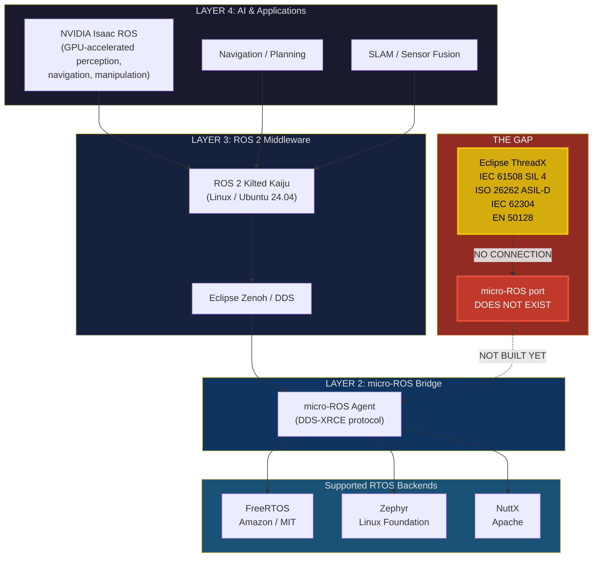
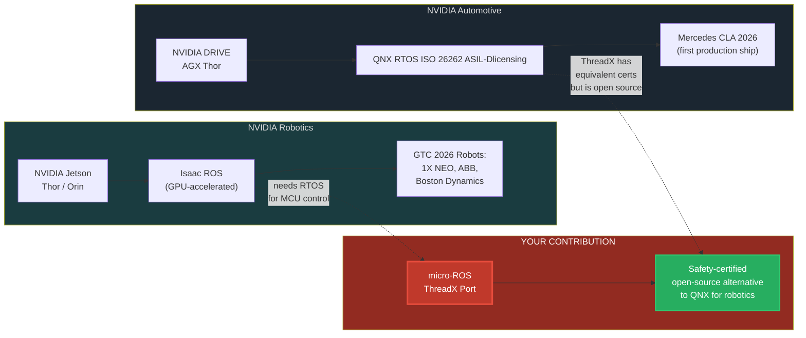

# micro-ROS + Eclipse ThreadX: The Opportunity Gap

*Created: 2026-03-16 | Companion to `rtos-ros-nvidia-research.md`*

---

## The One-Line Pitch

> Eclipse ThreadX has safety certifications that the robotics industry needs,
> but nobody has connected it to the ROS 2 ecosystem via micro-ROS.
> **That bridge does not exist yet. You could build it.**

---

## 1. The Current Ecosystem (What Exists Today)

```
 =====================================================================
 |                     ROBOTICS SOFTWARE STACK                       |
 |                      (What ships in 2026)                         |
 =====================================================================

 LAYER 4 — APPLICATION / AI
 +-----------------------------------------------------------------+
 |  NVIDIA Isaac ROS    |   Navigation    |  Perception / SLAM     |
 |  (GPU-accelerated)   |   Planning      |  Manipulation          |
 +-----------------------------------------------------------------+
          |                     |                    |
          v                     v                    v
 LAYER 3 — MIDDLEWARE
 +-----------------------------------------------------------------+
 |                         ROS 2 (Kilted Kaiju)                    |
 |           DDS / Eclipse Zenoh  |  ros2_control                  |
 |                Runs on Linux (Ubuntu 24.04)                     |
 +-----------------------------------------------------------------+
          |
          | ROS 2 messages over DDS-XRCE / Zenoh
          v
 LAYER 2 — REAL-TIME BRIDGE
 +-----------------------------------------------------------------+
 |                          micro-ROS                              |
 |        (Brings ROS 2 communication to microcontrollers)         |
 |                                                                 |
 |   Supported RTOS backends:                                      |
 |   +-------------+  +-------------+  +-------------+            |
 |   |  FreeRTOS   |  |   Zephyr    |  |    NuttX    |            |
 |   | (Amazon/MIT)|  | (Linux Fdn) |  |  (Apache)   |            |
 |   +-------------+  +-------------+  +-------------+            |
 +-----------------------------------------------------------------+
          |                     |                    |
          v                     v                    v
 LAYER 1 — HARDWARE
 +-----------------------------------------------------------------+
 |  STM32  |  ESP32  |  Renesas RA  |  Nordic nRF  |  RISC-V     |
 |                  Motor control, sensor I/O                      |
 +-----------------------------------------------------------------+


 ==========================      =======================================
 |    DISCONNECTED ISLAND  |    |       AUTOMOTIVE (SEPARATE WORLD)    |
 ==========================      =======================================

 +------------------------+      +-------------------------------------+
 |    Eclipse ThreadX     |      |      NVIDIA DRIVE + QNX             |
 |                        |      |                                     |
 |  - IEC 61508 SIL 4    |      |  - ISO 26262 ASIL-D                 |
 |  - ISO 26262 ASIL-D   |      |  - DRIVE AGX Thor (2000 TFLOPS)     |
 |  - IEC 62304          |      |  - Mercedes CLA 2026                |
 |  - EN 50128           |      |  - Proprietary, no ROS 2            |
 |  - Open source (EPL)  |      |  - QNX license: $$$$                |
 |                        |      |                                     |
 |  NO micro-ROS support  |      |  NO micro-ROS support               |
 |  NO ROS 2 integration  |      |  NO ROS 2 integration               |
 +------------------------+      +-------------------------------------+
         ^                                    ^
         |                                    |
    YOU ARE HERE                     Locked behind vendor
    (ThreadX experience)             (not a viable entry point)
```

---

## 2. The Gap (Mermaid Diagram)



---

## 3. The Opportunity (What You Would Build)

```
 BEFORE (today)                          AFTER (with your contribution)
 ==============================          ==============================

 ROS 2 + Isaac ROS                       ROS 2 + Isaac ROS
       |                                       |
    micro-ROS                               micro-ROS
    /   |   \                              /   |   \   \
 Free  Zeph  NuttX                      Free  Zeph NuttX ThreadX
 RTOS  yr                               RTOS  yr          |
                                                     SAFETY CERTS
  ThreadX                                          IEC 61508 SIL 4
  (isolated,                                       ISO 26262 ASIL-D
   unused in                                            |
   robotics)                                     UNLOCKED USE CASES:
                                                 - Safety-certified robots
                                                 - Autonomous vehicles
                                                 - Medical robotics
                                                 - Industrial automation
                                                 - Railway systems
```

### What the Port Actually Requires

```
 +--------------------------------------------------------------+
 |              micro-ROS ThreadX Port: Work Items               |
 +--------------------------------------------------------------+
 |                                                                |
 |  1. TRANSPORT LAYER                                            |
 |     Implement micro-ROS transport (UART/UDP/TCP)               |
 |     on ThreadX NetX Duo networking stack                       |
 |                                                                |
 |  2. RTOS ABSTRACTION LAYER                                     |
 |     Map micro-ROS RTOS primitives to ThreadX equivalents:      |
 |     - tx_thread_create()     -> task creation                  |
 |     - tx_mutex_get/put()     -> mutex lock/unlock              |
 |     - tx_semaphore_get/put() -> semaphore operations           |
 |     - tx_timer_create()      -> timer management               |
 |     - tx_byte_pool_allocate()-> memory allocation              |
 |                                                                |
 |  3. CLOCK / TIME SOURCE                                        |
 |     Provide clock_gettime() equivalent using ThreadX           |
 |     tx_time_get() or hardware timer                            |
 |                                                                |
 |  4. BUILD SYSTEM INTEGRATION                                   |
 |     CMake toolchain file for ThreadX cross-compilation         |
 |     Integration with micro_ros_setup build infrastructure      |
 |                                                                |
 |  5. REFERENCE HARDWARE                                         |
 |     STM32 (already has ThreadX support via STM32Cube)          |
 |     Renesas RA (ThreadX is the default RTOS)                   |
 |     RISC-V targets (ThreadX adding support 2025-2026)          |
 |                                                                |
 +--------------------------------------------------------------+
```

---

## 4. Why This Gap Matters: The Safety Certification Landscape

```
                        SAFETY CERTIFICATIONS REQUIRED BY INDUSTRY
                        ==========================================

  INDUSTRY          STANDARD           WHO HAS IT          micro-ROS?
  --------          --------           ----------          ----------
  Industrial        IEC 61508          ThreadX, QNX        NO (for ThreadX)
  Automotive        ISO 26262          ThreadX, QNX        NO
  Medical           IEC 62304          ThreadX             NO
  Railway           EN 50128           ThreadX             NO

  =========================================================================

  TODAY'S PROBLEM:
  +-----------------------------------------------------------------+
  |  If you need BOTH safety certification AND ROS 2 integration:   |
  |                                                                 |
  |  Option A: QNX + custom integration    --> $$$$ licensing cost  |
  |  Option B: FreeRTOS + micro-ROS        --> NO safety certs      |
  |  Option C: Zephyr + micro-ROS          --> NO safety certs      |
  |  Option D: ThreadX + micro-ROS         --> DOES NOT EXIST       |
  |                                                                 |
  |  Option D is the only open-source path to safety-certified      |
  |  ROS 2 on microcontrollers. Nobody has built it.                |
  +-----------------------------------------------------------------+
```

---

## 5. GTC 2026 Context: Where This Fits in NVIDIA's World



### Key observations from GTC 2026

- Every humanoid robot shown (1X NEO, ABB, etc.) uses the **ROS 2 + RTOS split architecture**
- NVIDIA DRIVE uses QNX because it has safety certs -- ThreadX has the **same certs** but is **open source**
- NVIDIA Isaac uses ROS 2 on Linux -- the MCU layer underneath needs an RTOS
- No one at GTC presented a safety-certified micro-ROS solution
- The "last mile" between AI planning (Isaac) and physical actuation (motors) runs on an RTOS

---

## 6. Career Value Chain

```
 YOUR CURRENT POSITION                YOUR TARGET POSITION
 =====================                ====================

 +-------------------+                +---------------------------+
 | ThreadX / RTOS    |                | Robotics Systems Engineer |
 | Experience        |                | at tier-1 company         |
 +-------------------+                +---------------------------+
         |                                       ^
         |                                       |
         v                                       |
 +-------------------+                +---------------------------+
 | Build micro-ROS   |   VISIBILITY  | Open-source contributor   |
 | ThreadX port      | ------------> | recognized in BOTH:       |
 | (open-source      |   IN TWO      | - Eclipse Foundation      |
 |  contribution)    |   COMMUNITIES | - Open Robotics / ROS     |
 +-------------------+                +---------------------------+
         |                                       |
         v                                       v
 +--------------------------------------------------------------+
 |                    TARGET EMPLOYERS                            |
 +--------------------------------------------------------------+
 |                                                                |
 |  HUMANOID ROBOTICS          INDUSTRIAL / AV                    |
 |  -----------------          ---------------                    |
 |  Boston Dynamics            NVIDIA (Isaac / DRIVE)             |
 |  Figure AI                  Bosch                              |
 |  Tesla (Optimus)            ABB Robotics                       |
 |  Agility Robotics           Siemens                            |
 |  1X Technologies            Continental                        |
 |  Apptronik                  Motional                           |
 |  Sanctuary AI               Waymo                              |
 |                                                                |
 |  WHY THEY WOULD CARE:                                          |
 |  - You understand both RTOS internals and ROS 2 architecture   |
 |  - You have shipped safety-critical embedded + robotics code   |
 |  - You bridge two domains most engineers only know one of      |
 |  - Open-source track record proves you can deliver             |
 +--------------------------------------------------------------+
```

### The skill rarity argument

```
  Engineers who know         Engineers who know         Engineers who know
  Eclipse ThreadX            ROS 2 + micro-ROS          BOTH + built the bridge
  ================           =================          ======================

     ~50,000                    ~30,000                       ~0

                                                         <-- YOU WOULD BE HERE
```

---

## 7. Execution Roadmap

```
  PHASE 1 (Weeks 1-4)              PHASE 2 (Weeks 5-8)
  Study micro-ROS internals         Build the ThreadX port
  =======================           =====================
  - Clone micro_ros_setup           - Implement RTOS abstraction layer
  - Read FreeRTOS port code         - Map ThreadX primitives
  - Understand RTOS                 - Implement transport on NetX Duo
    abstraction layer               - Get "hello world" publisher
  - Set up STM32 + ThreadX            running on STM32
    dev environment                 - Write unit tests
  - Study Zephyr port for
    second reference

  PHASE 3 (Weeks 9-12)             PHASE 4 (Weeks 13+)
  Validate and upstream             Build visibility
  =====================             ==================
  - Test on multiple boards         - Write blog post / tutorial
    (STM32, Renesas RA)             - Present at ROS meetup or
  - Run micro-ROS demos               ROSCon
    (publisher, subscriber,         - Submit talk to Embedded
     service client)                   World or Eclipse conferences
  - Submit PR to                    - Engage ThreadX Alliance
    micro-ROS/micro_ros_setup       - Apply to target companies
  - Engage with Open Robotics         with the contribution on
    maintainers for review             your resume
```

---

## 8. Key Repositories to Study

| Repository | Purpose | URL |
|------------|---------|-----|
| `micro-ROS/micro_ros_setup` | Build system and RTOS port configs | github.com/micro-ROS/micro_ros_setup |
| `micro-ROS/freertos_apps` | FreeRTOS reference port (study this) | github.com/micro-ROS/freertos_apps |
| `micro-ROS/zephyr_apps` | Zephyr reference port (study this) | github.com/micro-ROS/zephyr_apps |
| `micro-ROS/micro_ros_platformio` | PlatformIO integration | github.com/micro-ROS/micro_ros_platformio |
| `eclipse-threadx/threadx` | ThreadX kernel source | github.com/eclipse-threadx/threadx |
| `eclipse-threadx/netxduo` | ThreadX networking (for transport) | github.com/eclipse-threadx/netxduo |

---

## Summary

The micro-ROS + Eclipse ThreadX opportunity is a rare convergence:

1. **Real technical gap** -- no one has built this, and the community is asking for it
2. **Safety certification moat** -- ThreadX is the only open-source RTOS with IEC 61508 / ISO 26262
3. **Growing market** -- humanoid robotics is the hottest sector in tech (GTC 2026 confirmed this)
4. **Career multiplier** -- bridges two communities, creates a unique skill profile
5. **Open-source leverage** -- a merged PR to micro-ROS is a permanent, public credential

The question is not whether this port is valuable. The question is whether you build it before someone else does.
